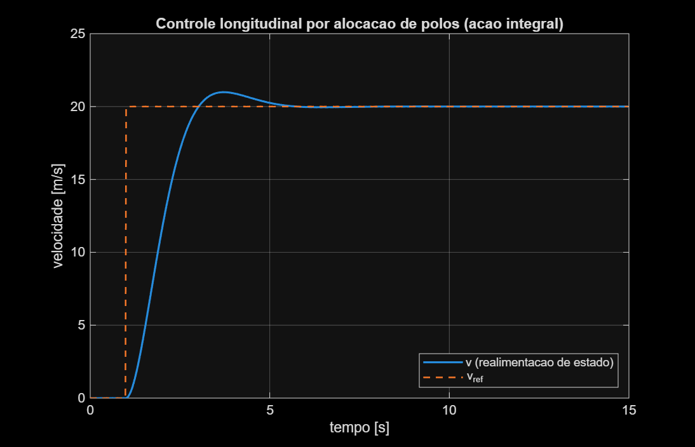
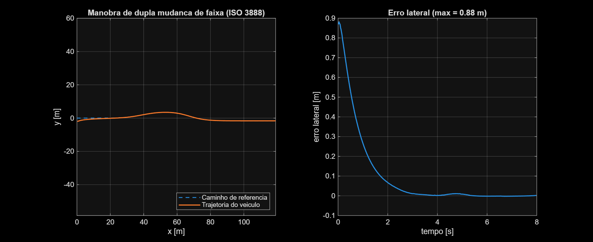
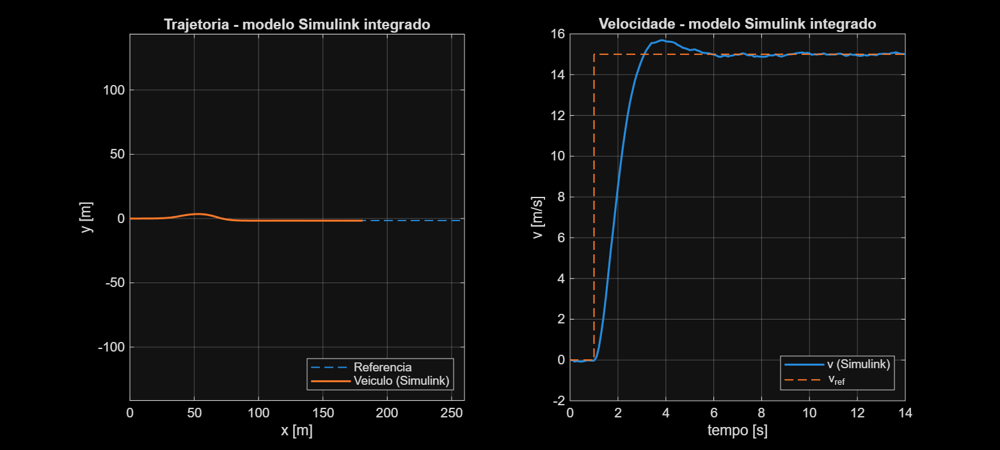

# Simulador de controle longitudinal e lateral de veículo autônomo

Controle aplicado ao domínio veicular: modelagem cinemática de um veículo (modelo bicicleta), controle de velocidade por realimentação de estado (alocação de polos) e controle de trajetória por Stanley Controller, integrados e testados com ruído de sensor e perturbação externa. Implementado em MATLAB e Simulink.

## Modelo do veículo

Kinematic bicycle model referenciado no eixo traseiro:

```
dx/dt     = v*cos(theta)
dy/dt     = v*sin(theta)
dtheta/dt = (v/L)*tan(delta)
dv/dt     = a
```

Onde `L` é o entre-eixos, `delta` o ângulo de esterçamento e `a` a aceleração longitudinal. Integração via Runge-Kutta de 4ª ordem (RK4), implementada em `BicycleModel.m` como classe `handle`.

## Controle longitudinal

Modelo da planta (massa + arrasto linear, linearizado em torno de `v0=20 m/s` a partir do arrasto aerodinâmico quadrático — Åström & Murray, _Feedback Systems_, cap. 3):

```
m*dv/dt = u - b*v
```

Controlador de **realimentação de estado com ação integral**, projetado por **alocação de polos** a partir de especificações de desempenho:

```
x = [v; xi]              xi = integral(v_ref - v) dt
u = -K1*v - K2*xi

K1 = 2*zeta*wn*m - b
K2 = -m*wn^2
```

Com `zeta=0,7`, `wn=1,576 rad/s`, `m=1500 kg`, `b≈16,2 N·s/m`. Polos de malha fechada validados numericamente. Resposta ao degrau: overshoot de 4,93% (teórico: 4,60%), acomodação em 3,76s, erro em regime permanente nulo.



## Controle lateral

**Stanley Controller**, testado numa manobra de dupla mudança de faixa (norma **ISO 3888**):

```
delta = theta_e + atan2(k*e, v)
```

Onde `theta_e` é o erro de heading (caminho − veículo) e `e` é o erro lateral (cross-track), projetado no eixo dianteiro do veículo. Erro lateral máximo de 0,5m, convergindo para a trajetória de referência ao longo da manobra.



## Modelo Simulink integrado

  `integrated_vehicle_control.slx`, com os dois controladores rodando no mesmo loop (velocidade real alimentando o Stanley), organizado em subsistemas:

- **`Longitudinal_Control`** — realimentação de estado com ação integral, construída com blocos padrão (Sum, Integrator, Gain).
- **`Vehicle_Plant`** — dinâmica do veículo (massa/arrasto + cinemática bicicleta), também com blocos padrão (Integrator, Trigonometric Function, Product).
- **`Stanley_Controller`** — bloco **MATLAB Function**, já que a busca do ponto mais próximo no caminho é algorítmica e fica mais clara como código do que forçada em blocos de diagrama.

Testado com ruído de sensor (velocidade e erro lateral) e uma rajada de vento lateral, modelada como perturbação na taxa de guinada. Erro lateral máximo de 0,50m (do offset inicial de teste); a rajada de vento isolada causa ~0,09m, recuperado em poucos segundos.



## Limitações e trabalho futuro

- Modelo cinemático (não dinâmico): assume que as rodas não escorregam e não modela massa/inércia no eixo lateral. Extensão natural: modelo bicicleta dinâmico com rigidez de curva (`Cf`, `Cr`) e momento de inércia (`Iz`).
- Perturbação de vento modelada como efeito cinemático simplificado, não como força física real — exigiria o modelo dinâmico acima para uma representação fisicamente completa.

## Arquivos

| Arquivo                          | Descrição                                                                           |
| -------------------------------- | ----------------------------------------------------------------------------------- |
| `BicycleModel.m`                 | Modelo cinemático (classe handle)                                                   |
| `state_feedback_control.m`       | Controle longitudinal por alocação de polos                                         |
| `stanley_lateral_control.m`      | Controle lateral (Stanley)                                                          |
| `integrated_vehicle_control.slx` | Modelo integrado no simulink                                                        |
| `load_parameters.m`              | Recarrega parâmetros no workspace (rodar antes de simular em sessão nova do MATLAB) |
| `plot_integrated_results.m`      | Plota resultado do modelo Simulink integrado                                        |

## Como reproduzir

```matlab
% Scripts puros
state_feedback_control
stanley_lateral_control

	% Simulink integrado 5
load_parameters
sim('integrated_vehicle_control')
plot_integrated_results
```